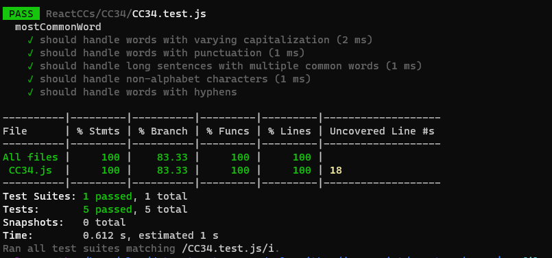

# Problem Domain:
The task is to solve a problem where you have a text (such as a book), and the goal is to determine the word that appears most frequently within that text. The challenge is to do this while ignoring capitalization, punctuation, and spaces. If multiple words have the same highest frequency, the function should return the first one encountered in the text.

# Algorithm:

Convert the text to lowercase to ensure case insensitivity.
Split the text into individual words, treating spaces and punctuation as word separators.
Count the frequency of each word and keep track of the word with the highest count.
Return the most frequent word.
# Efficiency:

Time Complexity (Big O): O(n), where "n" is the length of the input text.
The algorithm processes the input text once to split it into words and count their frequencies.
Space Complexity (Big O): O(k), where "k" is the number of unique words in the input text.
The algorithm uses memory to store word frequencies in a data structure.
The memory usage depends on the number of unique words in the text.

# Testing 

