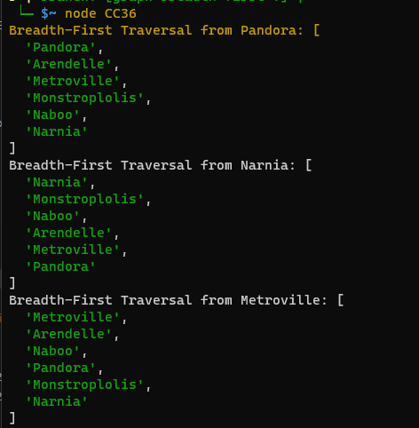

## CC36

## Problem Domain

You are given a graph represented as a collection of nodes and edges. Your task is to implement a breadth-first traversal algorithm to visit all nodes in the graph and return them in the order they were visited.

## Algorithm

1. Create a set to keep track of visited nodes.
2. Create an empty queue to store nodes to be visited.
3. Create an empty array to store the result of the traversal.
4. Add the starting node to the queue.
5. While the queue is not empty:
   - Dequeue a node from the front of the queue.
   - If the node has not been visited:
     - Mark the node as visited.
     - Add the node's value to the result array.
     - Enqueue all unvisited neighbors of the current node.
6. Continue the process until the queue is empty.
7. Return the result array containing the nodes visited in the order they were encountered.

## Time Complexity (Big O)

The time complexity of the breadth-first traversal algorithm for a graph with V vertices (nodes) and E edges (connections) is O(V + E), where:

- O(V) accounts for visiting each node once.
- O(E) accounts for visiting each edge once (for checking neighbors).

In the worst case, when the graph is densely connected, E can be close to V^2, making the time complexity O(V^2). However, for most practical cases, graphs are not fully connected, and the time complexity is closer to O(V + E).

In terms of space complexity, the algorithm uses additional memory for the queue and the set of visited nodes. The space complexity is O(V) because, in the worst case, you may need to store all nodes in the queue and the set.

Overall, breadth-first traversal is an efficient way to explore and visit all nodes in a graph while avoiding revisiting 
the same nodes multiple times.

# Testing

