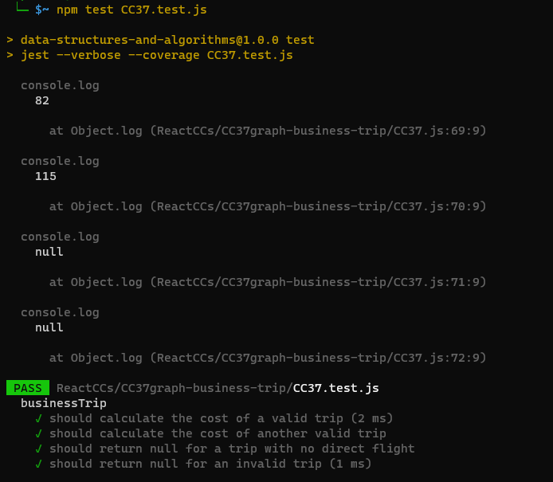

# Problem Domain:
You are given a city graph representing direct flight connections between cities, along with an array of city names that constitute a potential business trip. Your task is to determine if the trip is possible using direct flights and calculate the total cost of the trip if it is possible. If the trip is not possible with direct flights, return null.

# Algorithm:
Create a class Graph that represents the city graph. This class should have methods for adding vertices, adding edges (direct flight connections), and retrieving neighbors of a vertex.

Implement a businessTrip function that takes two parameters:

graph: An instance of the Graph class representing the city connections.
cities: An array of city names representing the business trip itinerary.
Initialize a variable totalCost to 0. This variable will store the total cost of the trip.

Loop through the cities array from the first city to the second-to-last city (index 0 to cities.length - 2).

For each city in the loop:
Retrieve the neighbors of the current city using the getNeighbors method from the Graph class.
Check if the next city in the itinerary exists in the neighbors.
If it does, find the direct flight cost to the next city and add it to totalCost.
If it doesn't, return null as there is no direct flight.
After the loop, return totalCost as the cost of the trip.

# Big O Analysis:
Let's analyze the time complexity of the businessTrip function:

The loop iterates through the cities array once, which has a length of n (where n is the number of cities in the itinerary).
Inside the loop, we perform operations such as retrieving neighbors and finding direct flight costs, which typically have a constant or O(1) time complexity for each operation.
Therefore, the overall time complexity of the businessTrip function is O(n) since it depends linearly on the number of cities in the itinerary.

# Testing 

