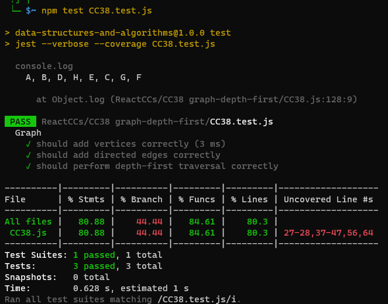

# Problem Domain:

You are given a graph represented by a set of vertices and directed edges. Your task is to implement a depth-first pre-order traversal algorithm that starts from a given node and returns a collection of nodes in their pre-order depth-first traversal order.

# Algorithm:

Create a Graph class with methods to add vertices and directed edges, as well as a depthFirst method for traversal.
The depthFirst method will take a starting node as an argument.
Inside the depthFirst method, initialize an empty visited set and an empty result array to store the traversal order.
Define a recursive helper function, dfs, that will perform the depth-first traversal.
In the dfs function:
Add the current node to the visited set to mark it as visited.
Add the current node to the result array.
Retrieve the neighbors (adjacent nodes) of the current node from the graph's adjacency list.
For each neighbor:
If the neighbor has not been visited (i.e., not in the visited set), recursively call the dfs function on the neighbor.
Call the dfs function with the starting node as an argument to initiate the traversal.
Return the result array containing the pre-order traversal order.
Big O Complexity Analysis:

# Time Complexity (Big O): O(V + E), where V is the number of vertices and E is the number of edges in the graph.
The time complexity is determined by the depth-first traversal, which visits each vertex and each edge once.
In the worst case, the algorithm must explore all vertices and edges, resulting in a linear time complexity.
Space Complexity (Big O): O(V), where V is the number of vertices.
The space complexity is determined by the space required for the visited set and the result array.
In the worst case, the algorithm may need to store all vertices in the visited set, resulting in a linear space complexity.

# Testing
