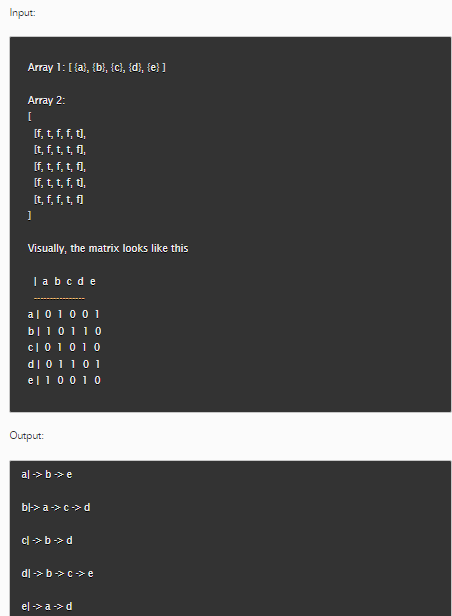

# Problem Domain


# **Solution:**

The provided solution is a JavaScript code that converts an adjacency matrix representation of a graph into an adjacency list representation. It follows these main steps:

1. Initialize an empty `adjacencyList` object to store the adjacency list representation.
2. Iterate through the `nodes` array and create an empty array for each node in the `adjacencyList`.
3. Use nested loops to iterate through the rows and columns of the `matrix`.
4. If `matrix[i][j]` is `true`, it indicates a connection between `nodes[i]` and `nodes[j]`, so add `nodes[j]` to the adjacency list of `nodes[i]`.
5. Format the adjacency list as specified, where each node is followed by its neighbors separated by "->".
6. Return the formatted adjacency list.

# **Algorithm:**

1. Initialize `adjacencyList` as an empty object.
2. For each `node` in the `nodes` array:
   - Initialize an empty array as `neighbors` for the `node`.
   - Add an entry to `adjacencyList` where the key is the `node` and the value is `neighbors`.
3. Iterate through the rows of the `matrix` using index `i`:
   - Iterate through the columns of the `matrix` using index `j`:
     - If `matrix[i][j]` is `true`, push `nodes[j]` to `neighbors` of `nodes[i]`.
4. Initialize an empty object `formattedAdjacencyList`.
5. For each `node` in `adjacencyList`:
   - Create a formatted string where the node is followed by its neighbors joined with "->".
   - Store this string in `formattedAdjacencyList` with the node as the key.
6. Return `formattedAdjacencyList`.

# **Pseudocode:**

```plaintext
function adjacencyMatrixToList(nodes, matrix):
    adjacencyList = {} // Initialize an empty object

    // For each node in nodes, create an empty array as neighbors
    for node in nodes:
        neighbors = []
        adjacencyList[node] = neighbors

    // Iterate through the matrix to populate the adjacency list
    for i from 0 to length of nodes:
        for j from 0 to length of nodes:
            if matrix[i][j] is true:
                push nodes[j] to neighbors of nodes[i]

    formattedAdjacencyList = {} // Initialize an empty object

    // Format the adjacency list
    for node in adjacencyList:
        formattedString = node + "| -> " + neighbors of node joined with " -> "
        store formattedString in formattedAdjacencyList with node as the key

    return formattedAdjacencyList
```

# **Big O:**

- Time Complexity: O(V^2), where V is the number of nodes. This is because we have nested loops to iterate through the matrix, which has V rows and V columns.
- Space Complexity: O(V), as we store the adjacency list for each node.