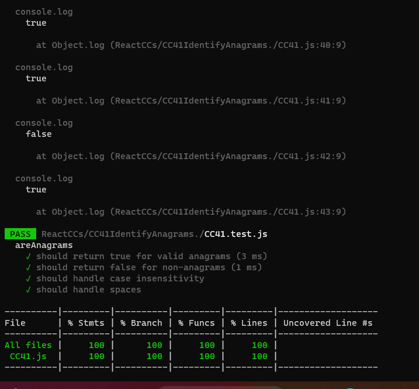

# Problem Domian 
Write a function to validate whether or not two given strings are anagrams (contain the same letters).

# Algorithm:

- Remove spaces and convert both input strings to lowercase for case-insensitive comparison.
- Check if the lengths of the two strings are different. If they are different, they cannot be anagrams, so return false.
- Create two objects (charCount1 and charCount2) to count character occurrences for each string.
- Populate charCount1 by iterating through the characters in str1 and incrementing the count for each character.
- Populate charCount2 by iterating through the characters in str2 and incrementing the count for each character.
- Compare the two objects charCount1 and charCount2. If they are equal, return true, indicating that the strings are anagrams. Otherwise, return false.

# Pseudocode:

'''
function areAnagrams(str1, str2):
    // Remove spaces and convert both strings to lowercase for case-insensitive comparison
    str1 = str1.replace(/\s/g, '').toLowerCase()
    str2 = str2.replace(/\s/g, '').toLowerCase()

    // Check if the lengths of the two strings are different
    if length of str1 is not equal to length of str2:
        return false

    // Create objects to count character occurrences
    charCount1 = {}
    charCount2 = {}

    // Populate charCount1
    for each character in str1:
        if character exists in charCount1:
            increment the count of character in charCount1
        else:
            initialize count of character in charCount1 to 1

    // Populate charCount2
    for each character in str2:
        if character exists in charCount2:
            increment the count of character in charCount2
        else:
            initialize count of character in charCount2 to 1

    // Compare the two objects
    for each character in charCount1:
        if count of character in charCount1 is not equal to count of character in charCount2:
            return false

    return true
'''

# Big O Complexity Analysis:

Time Complexity (Big O): O(n)
The time complexity of this function is linear because it iterates through both input strings once (O(n)), where 'n' is the length of the longer input string.
Space Complexity: O(1) (constant space)
The space complexity is constant because it uses a fixed amount of additional memory to store character counts, and the space required does not depend on the input size.

# Testing

