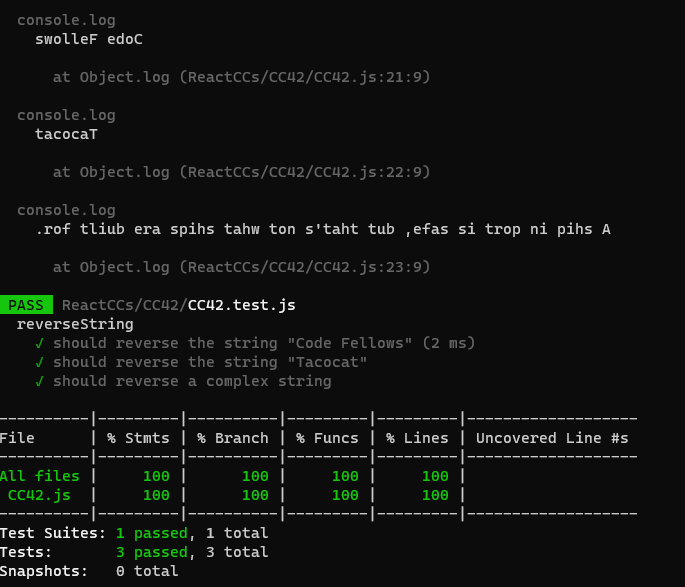

**Problem Domain:**

The problem is to reverse a given string. For example, if the input string is "Code Fellows," the output should be "swolleF edoC."

**Algorithm:**

1. Initialize an empty string `reversedStr` to store the reversed string.
2. Start a loop that iterates from the end of the input string to the beginning.
3. In each iteration, append the character at the current index to the `reversedStr` string.
4. Continue this process until you've iterated through the entire input string.
5. Return the `reversedStr` as the result, which is the reversed string.

**JavaScript Code:**
```
function reverseString(inputString) {
  let reversedStr = '';
  for (let i = inputString.length - 1; i >= 0; i--) {
    reversedStr += inputString[i];
  }
  return reversedStr;
}
```

**Big O Complexity Analysis:**

- Time Complexity (Big O): O(n)
  - The time complexity of this algorithm is O(n), where n is the length of the input string. This is because we iterate through the entire string once to reverse it, and the number of iterations is directly proportional to the length of the input.

- Space Complexity (Big O): O(n)
  - The space complexity is also O(n), where n is the length of the input string. This is because we create a new string (`reversedStr`) to store the reversed string, and the space required is directly proportional to the length of the input.

The algorithm has a linear time complexity, meaning that the time it takes to reverse a string grows linearly with the size of the string. Similarly, the space complexity grows linearly with the size of the string because we create a new string to store the reversed result.

# Testing

