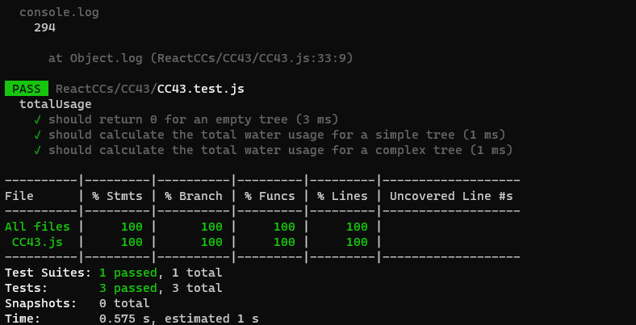

# Problem Domain:
Problem Statement: We want to calculate the total water usage for a sprinkler system schematic. The system consists of an inlet and a number of connected sprinkler heads that spray water.
Each sprinkler head has a T connection that can be connected to 0, 1, or 2 other sprinklers.
There are no connected loops in the system.
Each sprinkler head is configured for a certain amount of output, each potentially different, in milliliters per minute.
The distance between sprinkler heads is irrelevant.
# Algorithm:
We can approach this problem using a recursive depth-first traversal of the binary tree representing the sprinkler system.

Function totalUsage(root):
If the root is null, return 0 (base case).
Calculate the total usage for the current node:
nodeTotal = root.value (value of the current sprinkler head).
Recursively calculate the total usage for the left and right subtrees:
leftTotal = totalUsage(root.left)
rightTotal = totalUsage(root.right)
Return the sum of the current node's usage and the total usage of its children:
return nodeTotal + leftTotal + rightTotal
# Big O Analysis:
Time Complexity: The algorithm traverses every node in the binary tree exactly once. Since each node is visited once, the time complexity is O(n), where n is the number of nodes in the binary tree.

Space Complexity: The space complexity is determined by the depth of the recursion, which corresponds to the height of the binary tree. In the worst case, if the tree is unbalanced and resembles a linked list, the space complexity is O(n). However, in a balanced tree, the space complexity is O(log n).

# Testing
