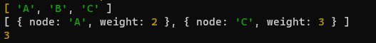

# Graphs

## Problem Domain
Implement a graph data structure using an adjacency list and provide methods to:
- Add vertices
- Add edges between vertices
- Get all vertices
- Get neighbors of a vertex
- Calculate the size of the graph

## Algorithm
1. **Initialization**: Create a `Graph` class with an instance variable `adjacencyList`, which is a Map to store vertices and their adjacent vertices.

2. **addVertex(vertex)**:
   - Check if the vertex already exists in the `adjacencyList`. If not, add it as a key with an empty array as the value.
   - Return the added vertex.

3. **addEdge(startVertex, endVertex, weight = 0)**:
   - Check if both `startVertex` and `endVertex` exist in the `adjacencyList`. If not, throw an error.
   - Add an edge between `startVertex` and `endVertex` with an optional weight (default is 0) to their respective adjacency lists.
   
4. **getVertices()**:
   - Return an array containing all the vertices in the `adjacencyList`.

5. **getNeighbors(vertex)**:
   - Check if the `vertex` exists in the `adjacencyList`. If not, throw an error.
   - Return an array containing the neighbors of the `vertex` along with their weights.

6. **size()**:
   - Return the size of the graph, which is the number of vertices in the `adjacencyList`.

Certainly, here's the JavaScript code for the graph implementation along with markdown formatting:

javascript
Copy code

# Big O Analysis
addVertex(vertex): O(1) - Constant time as it involves adding a vertex to the Map.
addEdge(startVertex, endVertex, weight = 0): O(1) - Constant time as it involves adding an edge to the adjacency list of vertices.
getVertices(): O(V) - Linear time, where V is the number of vertices in the graph, as it involves iterating over the keys of the Map.
getNeighbors(vertex): O(E) - Linear time, where E is the number of edges connected to the given vertex, as it involves iterating over the neighbors.
size(): O(1) - Constant time as it returns the size of the Map.

# Testing

