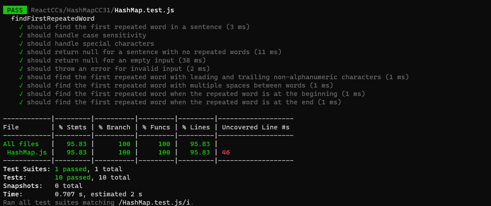

### Problem Domain:
Given a text string, you need to find the first word that occurs more than once in the string. Words are delimited by spaces, and you should consider the words in a case-insensitive manner. Ignore any leading or trailing non-alphanumeric characters. If no repeated word is found, return `null`.

### Algorithm:
1. Create a function `findFirstRepeatedWord(text)` that takes a single argument `text`, which is the input text string.
2. Check if the input is valid. If `text` is empty or not a string, throw an error with the message "Invalid input: Please provide a valid text string."
3. Create a hashmap (JavaScript object) to store encountered words. Initialize it as an empty object.
4. Split the input `text` into words using spaces as the delimiter and store them in an array called `words`.
5. Loop through each word in the `words` array.
   - Remove any leading and trailing non-alphanumeric characters and convert the word to lowercase.
   - Check if the word is already a key in the hashmap.
     - If it is, return the word as it's the first repeated word.
     - If it's not, add it to the hashmap with a value of `true` to indicate that it has been encountered.
6. If the loop completes without finding a repeated word, return `null` to indicate that no repeated word was found.


### Big O Analysis:
- Time Complexity: O(n), where n is the length of the input text.
- Space Complexity: O(m), where m is the number of unique words in the input text.

### Tracing Example:
Let's trace the function with an example:
```javascript
const text = "Once upon a time, there was a brave princess who lived in a castle. The brave princess went on an adventure to save the kingdom.";
const result = findFirstRepeatedWord(text);
console.log(result); // Output: "brave"
```
- Iteration 1: Word "once" is encountered, added to the hashmap. (`wordMap = { "once": true }`)
- Iteration 2: Word "upon" is encountered, added to the hashmap. (`wordMap = { "once": true, "upon": true }`)
- Iteration 3: Word "a" is encountered, added to the hashmap. (`wordMap = { "once": true, "upon": true, "a": true }`)
- Iteration 4: Word "time" is encountered, added to the hashmap. (`wordMap = { "once": true, "upon": true, "a": true, "time": true }`)
- Iteration 5: Word "there" is encountered, added to the hashmap. (`wordMap = { "once": true, "upon": true, "a": true, "time": true, "there": true }`)
- Iteration 6: Word "was" is encountered, added to the hashmap. (`wordMap = { "once": true, "upon": true, "a": true, "time": true, "there": true, "was": true }`)
- Iteration 7: Word "brave" is encountered, added to the hashmap. (`wordMap = { "once": true, "upon": true, "a": true, "time": true, "there": true, "was": true, "brave": true }`)
- Iteration 8: Word "princess" is encountered, added to the hashmap. (`wordMap = { "once": true, "upon": true, "a": true, "time": true, "there": true, "was": true, "brave": true, "princess": true }`)
- Iteration 9: Word "who" is encountered, added to the hashmap. (`wordMap = { "once": true, "upon": true, "a": true, "time": true, "there": true, "was": true, "brave": true, "princess": true, "who": true }`)
- Iteration 10: Word "lived" is encountered, added to the hashmap. (`wordMap = { "once": true, "upon": true, "a": true, "time": true, "there": true, "was": true, "brave": true, "princess": true, "who": true, "lived": true }`)
- Iteration 11: Word "in" is encountered, added to the hashmap. (`wordMap = { "once": true, "upon": true, "a": true, "time": true, "there": true, "was": true, "brave": true, "princess": true, "who": true, "lived": true, "in": true }`)
- Iteration 12: Word "castle" is encountered, added to the hashmap. (`wordMap = { "once": true, "upon": true, "a": true, "time": true, "there": true, "was": true, "brave": true, "princess": true, "who": true, "lived": true, "in": true, "castle": true }`)
- Iteration 13

: Word "the" is encountered, it's already in the hashmap, so we return "the" as the first repeated word.

The function returns "brave" as the first repeated word.

### Testing
 

