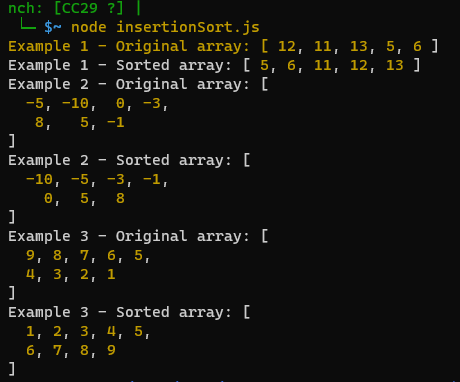

# **Problem Domain:**
Implement the insertion sort algorithm to sort an array of integers in ascending order. The algorithm should not use any built-in sorting methods available in the language.

# **Solution:**
The insertion sort algorithm involves dividing the array into a "sorted" and an "unsorted" portion. Elements from the unsorted portion are picked one by one and inserted into their correct positions within the sorted portion of the array.

# **Algorithm:**

1. Start with the second element (index 1) of the array.
2. Compare the current element with the previous elements.
3. If the current element is smaller, move the previous element one position ahead.
4. Repeat this process until you find the correct position for the current element.
5. Insert the current element at the correct position.
6. Move to the next element and repeat steps 2-5 until the entire array is sorted.

# **Visualization:**

Let's walk through an example using the input array `[3, -1, 7, 2, 5, 0, 4]`.

1. Initial Array: `[3, -1, 7, 2, 5, 0, 4]`
2. First Pass:
   - Current Element: -1
   - Compare with 3, insert at index 0: `[-1, 3, 7, 2, 5, 0, 4]`
3. Second Pass:
   - Current Element: 7
   - Compare with 3, no need to move: `[-1, 3, 7, 2, 5, 0, 4]`
4. Third Pass:
   - Current Element: 2
   - Compare with 7, 3, move 7 to index 2: `[-1, 3, 2, 7, 5, 0, 4]`
   - Compare with -1, insert at index 0: `[-1, 2, 3, 7, 5, 0, 4]`
5. Fourth Pass:
   - Current Element: 5
   - Compare with 7, no need to move: `[-1, 2, 3, 7, 5, 0, 4]`
6. Fifth Pass:
   - Current Element: 0
   - Compare with 7, 3, 2, move 3, 2 to indexes 4, 3: `[-1, 2, 0, 3, 5, 7, 4]`
   - Compare with -1, insert at index 0: `[-1, 0, 2, 3, 5, 7, 4]`
7. Sixth Pass:
   - Current Element: 4
   - Compare with 7, 5, move 7, 5 to indexes 6, 5: `[-1, 0, 2, 3, 4, 5, 7]`

Final Sorted Array: `[-1, 0, 2, 3, 4, 5, 7]`

This visualization demonstrates the step-by-step process of how the insertion sort algorithm sorts the input array.

# Testing 

