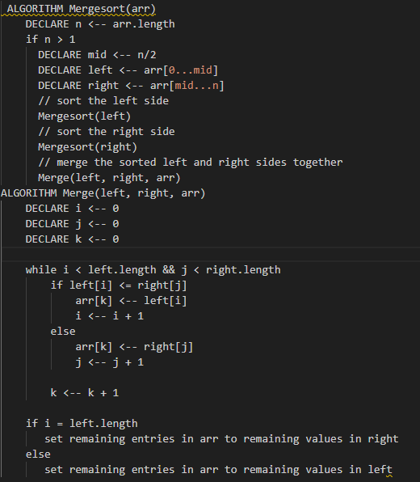
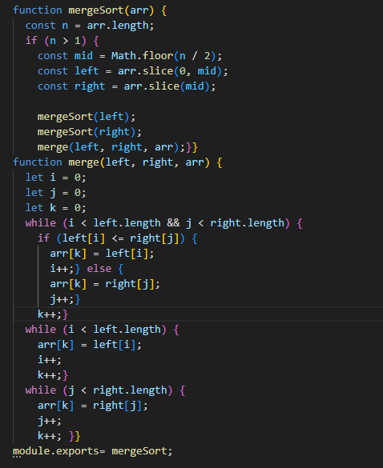
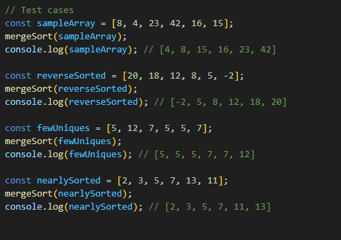
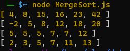
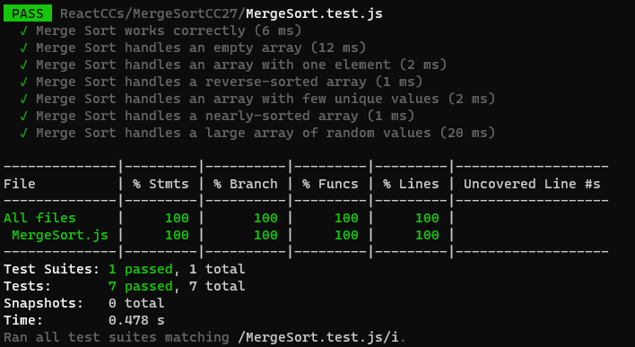

# Pseudocode

# Explaniation

This pseudocode represents the Merge Sort algorithm, which divides the array into smaller halves, sorts them, and then merges them back together to create a sorted array. The Mergesort algorithm is responsible for recursive division and sorting, while the Merge algorithm handles the merging of two sorted arrays.

# JS Code

# Complexity
Time Complexity: O(n log n)

The algorithm divides the array into halves logarithmically.
Each level of recursion involves linear work during merging.
Overall, it efficiently sorts by comparing and merging elements.
Space Complexity: O(n)

The algorithm uses temporary arrays for merging.
Recursion adds space for the call stack.
Efficient memory usage makes it practical for large datasets.

# Testing

# Unit Testing

