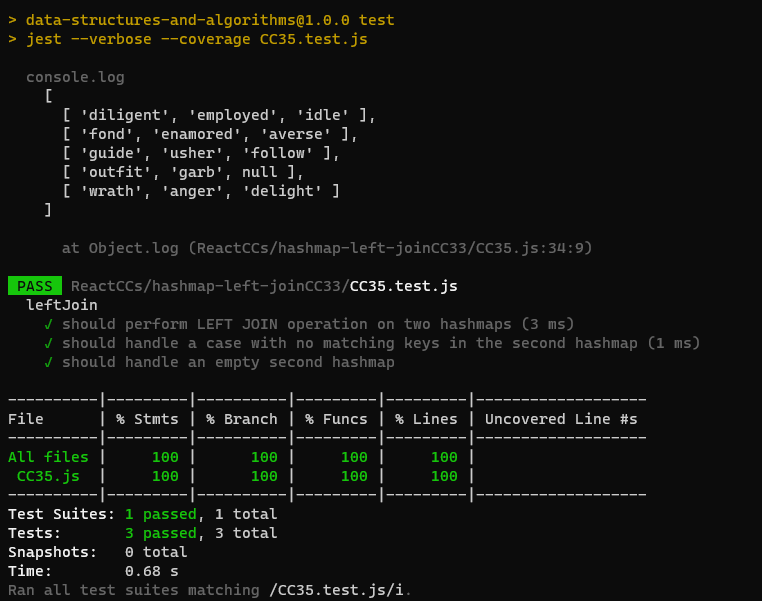

# Problem Domain:
The task is to implement a simplified LEFT JOIN for two hashmaps. The LEFT JOIN operation combines two hashmaps into a single data structure. The first hashmap contains word strings as keys and synonyms as values, while the second hashmap contains word strings as keys and antonyms as values. The goal is to return a data structure that holds the results according to LEFT JOIN logic, where all values from the first hashmap are returned, and if values exist in the second hashmap, they are appended to the result row. If no values exist in the second hashmap, NULL should be appended.

# Algorithm:
To implement the LEFT JOIN operation on two hashmaps, follow these steps:

Initialize an empty array called result to store the result.
Iterate through the keys of the first hashmap:
For each key:
Check if the key exists in the second hashmap.
If it exists, append an array to the result array with the key from the first hashmap, the value from the first hashmap, and the value from the second hashmap.
If it doesn't exist in the second hashmap, append an array to the result array with the key from the first hashmap, the value from the first hashmap, and NULL.
Return the result array as the final result of the LEFT JOIN operation.
# Big O Notation (Efficiency):

Time Complexity (Big O): O(n), where "n" is the number of keys in the first hashmap.
The algorithm iterates through the keys of the first hashmap once.
Space Complexity (Big O): O(n), where "n" is the number of keys in the first hashmap.
The space complexity is determined by the size of the result array, which holds the result of the LEFT JOIN operation.

# Testing
