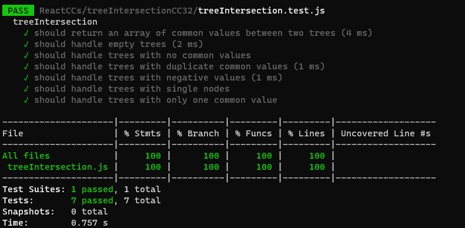

# Problem Domain:
You are given two binary trees, `tree1` and `tree2`. Write a function, `treeIntersection(tree1, tree2)`, that returns an array containing the values that appear in both `tree1` and `tree2`.

- The input binary trees are represented as instances of the `TreeNode` class, where each node has a value and references to its left and right children.

- The output should be an array containing the values that are common to both trees.

- If there are duplicate values in either tree, they should only appear once in the result.

# Algorithm:

1. Create an empty array, `commonValues`, to store the common values between the two trees.

2. Create a HashMap (an object in JavaScript) called `valuesHashmap` to keep track of the values in the first tree. This will help us quickly check if a value exists in the first tree while traversing the second tree.

3. Traverse the first tree using a recursive depth-first search (DFS) and populate the `valuesHashmap` with the values from the first tree.

4. Traverse the second tree using a recursive DFS.

   a. For each node in the second tree:
   
      i. Check if the node's value exists in `valuesHashmap`.

      ii. If it exists, add the value to the `commonValues` array.

5. Return the `commonValues` array as the result.


# Time Complexity (Big O): The time complexity of this solution is O(N + M), where N and M are the numbers of nodes in `tree1` and `tree2`, respectively. This is because we traverse both trees once.

# Space Complexity: The space complexity is O(N) due to the space required for the `valuesHashmap` and the recursive function call stack when traversing the first tree.

# Tracing

```
// Example usage:
const tree1 = new TreeNode(100);
tree1.left = new TreeNode(160);
tree1.right = new TreeNode(350);
tree1.left.left = new TreeNode(125);
tree1.left.right = new TreeNode(175);
tree1.right.left = new TreeNode(200);
tree1.right.right = new TreeNode(500);

const tree2 = new TreeNode(125);
tree2.left = new TreeNode(160);
tree2.right = new TreeNode(200);

const result = treeIntersection(tree1, tree2);
console.log(result); // Output: [160, 125, 200]
```

Let's trace the algorithm:

1. Initialize an empty array `commonValues` to store the common values between `tree1` and `tree2`.

2. Create an empty object `valuesHashmap` to store the values from `tree1`.

3. Start traversing `tree1` to populate `valuesHashmap`. We use a depth-first search (DFS) approach:

   - Node with value 100:
     - Populate `valuesHashmap`: `{ 100: true }`
     - Recursively call `traverseAndPopulate` for the left and right children.

   - Node with value 160:
     - Populate `valuesHashmap`: `{ 100: true, 160: true }`
     - Recursively call `traverseAndPopulate` for its children.

   - Node with value 125:
     - Populate `valuesHashmap`: `{ 100: true, 160: true, 125: true }`
     - Recursively call `traverseAndPopulate` for its children (which are null).

   - Node with value 175:
     - Populate `valuesHashmap`: `{ 100: true, 160: true, 125: true, 175: true }`
     - Recursively call `traverseAndPopulate` for its children (which are null).

   - Node with value 350:
     - Populate `valuesHashmap`: `{ 100: true, 160: true, 125: true, 175: true, 350: true }`
     - Recursively call `traverseAndPopulate` for its children.

   - Node with value 200:
     - Populate `valuesHashmap`: `{ 100: true, 160: true, 125: true, 175: true, 350: true, 200: true }`
     - Recursively call `traverseAndPopulate` for its children.

   - Node with value 500:
     - Populate `valuesHashmap`: `{ 100: true, 160: true, 125: true, 175: true, 350: true, 200: true, 500: true }`
     - Recursively call `traverseAndPopulate` for its children (which are null).

4. Now, we traverse `tree2` and check if each node's value exists in `valuesHashmap`:

   - Node with value 125: It exists in `valuesHashmap`, so we add 125 to `commonValues`.

   - Node with value 160: It exists in `valuesHashmap`, so we add 160 to `commonValues`.

   - Node with value 200: It exists in `valuesHashmap`, so we add 200 to `commonValues`.

5. After traversing `tree2`, `commonValues` contains `[160, 125, 200]`.

6. We return `commonValues` as the final result.

The algorithm successfully finds and returns the common values between `tree1` and `tree2`, which are `[160, 125, 200]`, as shown in the output.

# Testing

