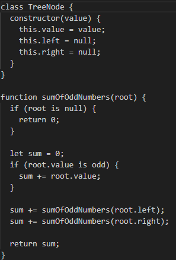

# CC19 Finding the sum of all odd numbers in a binary search tree

# Problem Description:
Find the sum of all the odd numbers in a binary search tree. Traversal methods such as depth-first or breadth-first are acceptable.

Output: 3 + 5 + 9 + 15 = 32

# Algorithm:

1. Create a class `TreeNode` to represent the nodes of the binary search tree. Each node should have a `value`, `left`, and `right` pointer.
2. Implement the function `sumOfOddNumbers(root)` that takes the root node of the binary search tree as input and returns the sum of all odd numbers in the tree.
3. In the `sumOfOddNumbers` function:
   a. If `root` is `null`, return 0, as there are no nodes to traverse, and the sum of odd numbers in an empty tree is 0.
   b. Initialize a variable `sum` to 0, which will hold the running sum of odd numbers.
   c. If the `root.value` is odd (i.e., `root.value % 2 !== 0`), add `root.value` to `sum`.
   d. Recursively call `sumOfOddNumbers` on the left subtree of the root (`root.left`) and add the returned value to `sum`.
   e. Recursively call `sumOfOddNumbers` on the right subtree of the root (`root.right`) and add the returned value to `sum`.
   f. Return the final value of `sum` as the result.

# pseudo code

# Big O Complexity:

- Time Complexity: O(n)
  - In the worst case, we may have to visit all nodes in the binary search tree to calculate the sum of odd numbers.
  - The time complexity is directly proportional to the number of nodes in the tree, represented by 'n'.
- Space Complexity: O(h)
  - The space complexity is determined by the maximum height of the call stack during recursive function calls.
  - In the worst case, the binary search tree is skewed, and the height of the tree is 'n', resulting in a space complexity of O(n).
  - In a balanced binary search tree, the height 'h' is logarithmic (h=log(n)), resulting in a space complexity of O(log(n)).