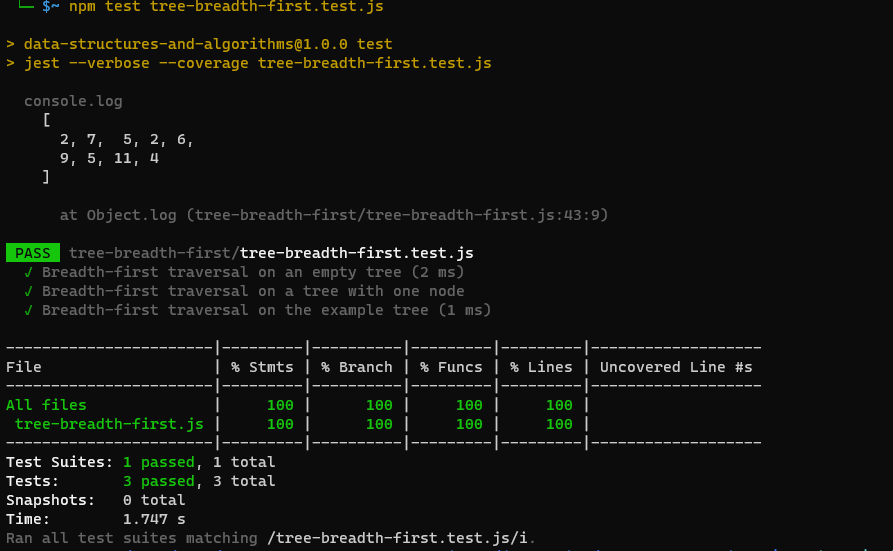

# tree-breadth-first 

# Problem Domain:

A tree data structure represented by the Node class is given. The task is to implement a function called breadthFirst that performs a Breadth-first traversal on the tree and returns a list of all the values encountered in the order they were visited.

# Input:

tree: The root node of the tree. It can be an instance of the Node class or null if the tree is empty.

# Output:

Returns an array containing all the values of the nodes in the tree, in the order they were encountered during the breadth-first traversal.
Constraints:

The input tree can be empty (null).
Each node in the tree has a unique value.
The tree may have multiple branches and levels.

# Steps representation of the breadth-first traversal
Step 1:
Queue: [2]
Visited Nodes: []
Result: []

Step 2:
Queue: [7, 5]
Visited Nodes: [2]
Result: [2]

Step 3:
Queue: [5, 2, 6]
Visited Nodes: [2, 7]
Result: [2, 7]

Step 4:
Queue: [2, 6, 9]
Visited Nodes: [2, 7, 5]
Result: [2, 7, 5]

Step 5:
Queue: [6, 9, 5]
Visited Nodes: [2, 7, 5, 2]
Result: [2, 7, 5, 2]

Step 6:
Queue: [9, 5, 11]
Visited Nodes: [2, 7, 5, 2, 6]
Result: [2, 7, 5, 2, 6]

Step 7:
Queue: [5, 11, 4]
Visited Nodes: [2, 7, 5, 2, 6, 9]
Result: [2, 7, 5, 2, 6, 9]

Step 8:
Queue: [11, 4]
Visited Nodes: [2, 7, 5, 2, 6, 9, 5]
Result: [2, 7, 5, 2, 6, 9, 5]

Step 9:
Queue: [4]
Visited Nodes: [2, 7, 5, 2, 6, 9, 5, 11]
Result: [2, 7, 5, 2, 6, 9, 5, 11]

Step 10:
Queue: []
Visited Nodes: [2, 7, 5, 2, 6, 9, 5, 11, 4]
Result: [2, 7, 5, 2, 6, 9, 5, 11, 4]

# Table representation

| Step | Queue                  | Visited Nodes              | Result                   |
|------|------------------------|----------------------------|--------------------------|
| 1    | [2]                    | []                         | []                       |
| 2    | [7, 5]                 | [2]                        | [2]                      |
| 3    | [5, 2, 6]              | [2, 7]                     | [2, 7]                   |
| 4    | [2, 6, 9]              | [2, 7, 5]                  | [2, 7, 5]                |
| 5    | [6, 9, 5]              | [2, 7, 5, 2]               | [2, 7, 5, 2]             |
| 6    | [9, 5, 11]             | [2, 7, 5, 2, 6]            | [2, 7, 5, 2, 6]          |
| 7    | [5, 11, 4]             | [2, 7, 5, 2, 6, 9]         | [2, 7, 5, 2, 6, 9]       |
| 8    | [11, 4]                | [2, 7, 5, 2, 6, 9, 5]      | [2, 7, 5, 2, 6, 9, 5]    |
| 9    | [4]                    | [2, 7, 5, 2, 6, 9, 5, 11] | [2, 7, 5, 2, 6, 9, 5, 11]|
| 10   | []                     | [2, 7, 5, 2, 6, 9, 5, 11, 4] | [2, 7, 5, 2, 6, 9, 5, 11, 4] |

# Tests 
